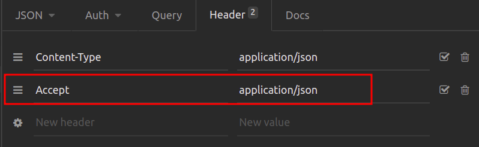

# Api Register Address - laravel/docker

### Step by step
Clone this Repository
```sh
git clone https://github.com/roxreis/api-register-address-laravel my-project
```

Create the .env file
```sh
cd my-project/
cp .env.example .env
```


Update environment variables in .env
```dosini
APP_NAME="Name Your Project"
APP_URL=http://localhost:8080

DB_CONNECTION=mysql
DB_HOST=mysql
DB_PORT=3306
DB_DATABASE=name_you_want_db
DB_USERNAME=root
DB_PASSWORD=root

CACHE_DRIVER=redis
QUEUE_CONNECTION=redis
SESSION_DRIVER=redis

REDIS_HOST=redis
REDIS_PASSWORD=null
REDIS_PORT=6379
```


Up containers
```sh
docker-compose up -d
```


Access the container
```sh
docker-compose exec laravel_8 bash
```


Install project dependencies
```sh
composer install
```


Generate the Laravel project key
```sh
php artisan key:generate
```


Generate migrations
```sh
php artisan make:migrate
```


Generate Fake address by factory
```sh
php artisan db:seed --class=AddressSeeder
```

Access the project
[http://localhost:8080](http://localhost:8080)

Api documentation - Swegger
[https://app.swaggerhub.com/apis/roxreis/register_address/1.0.0](https://app.swaggerhub.com/apis/roxreis/register_address/1.0.0)

*In Insomnia client, was necessary included this param to test PUT and POST routes*
